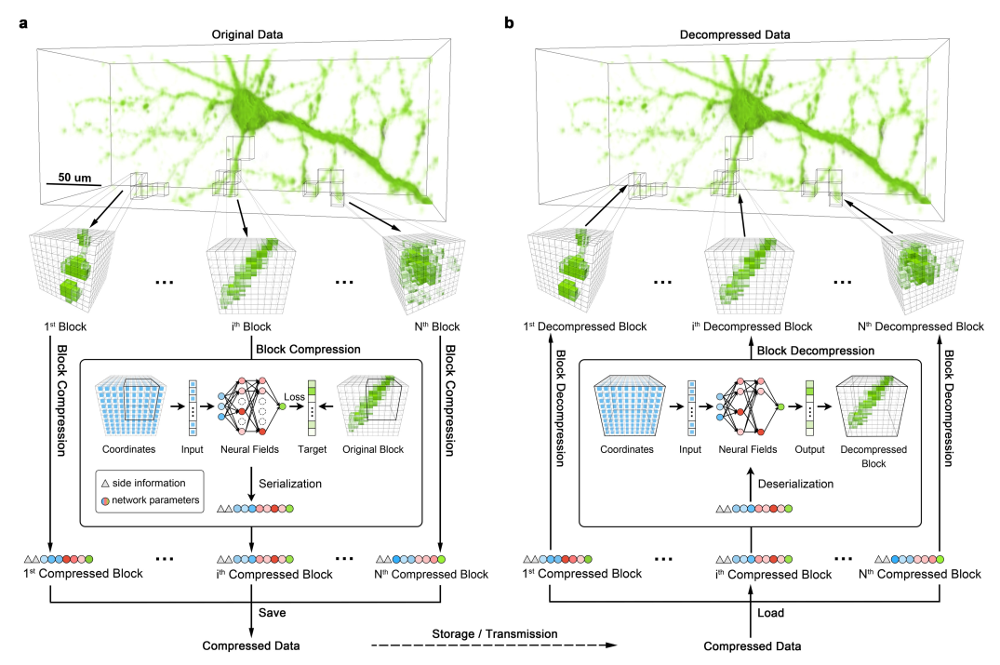
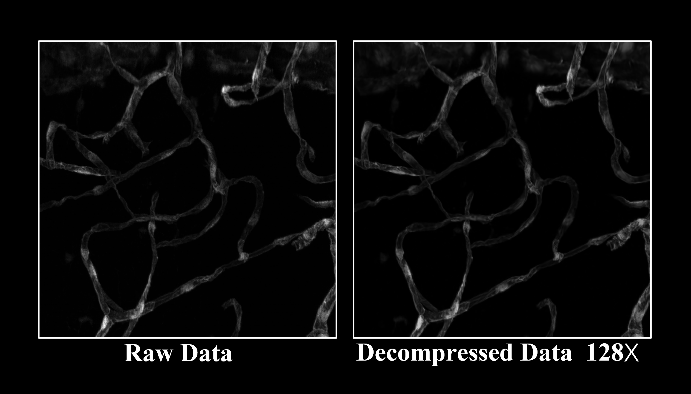
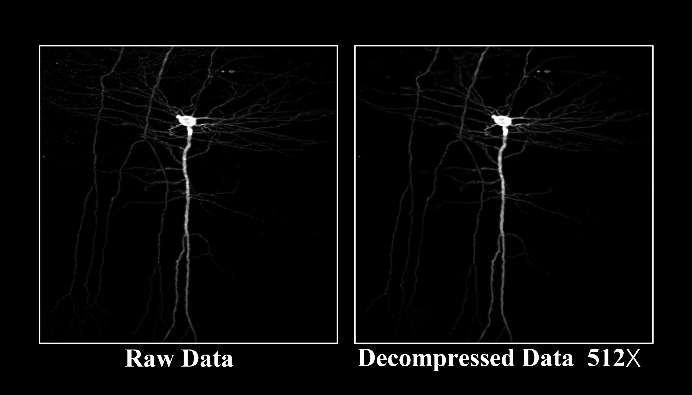
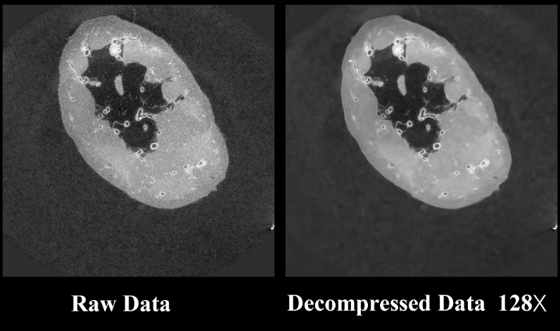

# 💾Biomedical data compRession with Implicit nEural Function (BRIEF)
### [\<Paper Link\>](https://www.biorxiv.org/content/10.1101/2022.12.03.518948v1) [\<CUDA Implementation\>](https://github.com/RichealYoung/BRIEF_CUDA)

Welcome to BRIEF! This repository is aimed at helping researchers or developers interested in BRIEF data compression algorithms to quickly understand and reproduce our latest research.

## Biological data


## Medical data


## Scheme



# 🚀Quickstart
## System requirements
- Ubuntu Linux (20.04.4 LTS)
- Anaconda3
- PyTorch
## Installation guide

### 1. Download project
```
git clone git@github.com:RichealYoung/BRIEF_PyTorch.git
```

### 2. Prepare the Conda enviroments
```
cd BRIEF_PyTorch
conda create -n brief python=3.10
conda activate brief
pip3 install -r requirements.txt
```

### 3. Register Gurobi and get license
[Register and install an academic license](https://www.gurobi.com/downloads/free-academic-license/) 
for the Gurobi optimizer (this is free for academic use).

## Usage Guide

### 1. Compress data without any partitioning strategy
```
python main.py -p opt/SingleTask/default.yaml -g 0
```
- The compressed result will be located in : **outputs/single\_\${time}/steps\${step}/compressed/**

- The decompressed data will be located in : **outputs/single\_\${time}/steps\${step}/decompressed/\${name}\_decompressed.tif**

- To visualize the compressing process: 
```
tensorboard --logdir=outputs/single_${time}
```

### 2. Compress data with adaptive partitioning
- Assume the available GPUs' indexs are 0,1,2,3
```
python main.py -p opt/DivideTask/default.yaml -g 0,1,2,3
```
- The compressed result will be located in : **outputs/divide\_\${time}/steps\${step}/compressed/**

- The decompressed data will be located in : **outputs/divide\_\${time}/steps\${step}/decompressed/\${name}\_decompressed.tif**

- To visualize the compressing process: 
```
tensorboard --logdir=outputs/divide_${time}
```
- Relevant hyper-parameters can be modified in **opt/DivideTask/default.yaml**.
### 3. Compress multiple data at once
- Assume the available GPUs' indexs are 0,1,2,3
```
python MultiTask.py -stp main.py -p opt/MultiTask/default.yaml -g 0,1,2,3 -onebyone
```
- The compressed result will be located in : **outputs/\${project}\_\${time}/steps\${step}/compressed/**

- The decompressed data will be located in : **outputs/\${project}\_\${time}/steps\${step}/decompressed/\${name}\_decompressed.tif**

- To visualize the compressing process: 
```
tensorboard --logdir=outputs/${project}_${time}
```
- Relevant hyper-parameters can be modified in **opt/MultiTask/default.yaml**.
### 4. Deblock

We provide a Python version **deblock.py** and a C++ version **deblock.cpp**. Some important parameters like **index_a**, **index_b**, and **thres** can be modified in the source file.

#### (1) Python version
To reduce the blocking artifacts of decompressed data that was partitioned
```
python deblock.py -stp outputs/${project}_${time}/steps${step}
```
The deblocked result will be located in : **outputs/\${project}\_\${time}/steps\${step}/deblock**
#### (2) C++ version
Install xxxxx
```
apt install xxx
```
Compile the source file
```
g++ deblock.cpp -o deblock -ltiff
```
To reduce the blocking artifacts of decompressed data that was partitioned
```
./deblock outputs/${project}_${time}/steps${step}
```
The deblocked result will be located in : **outputs/\${project}\_\${time}/steps\${step}/deblock**

## Demo for Biomedical Data

### 1. Vessels
```
python main.py -p opt/DivideTask/vessel.yaml -g 0
```


### 2. Neurons
```
python main.py -p opt/DivideTask/neuron.yaml -g 0
```


### 3. Organic CT
```
python main.py -p opt/DivideTask/hipct.yaml -g 0
```


# Citations
```
@article 
{
Yang2022.12.03.518948,
author = {Yang, Runzhao and Xiao, Tingxiong and Cheng, Yuxiao and Li, Anan and Qu, Jinyuan and Liang, Rui and Bao, Shengda and Wang, Xiaofeng and Suo, Jinli and Luo, Qingming and Dai, Qionghai},
title = {Sharing Massive Biomedical Data at Magnitudes Lower Bandwidth with Implicit Neural Function},
year = {2022},
doi = {10.1101/2022.12.03.518948},
journal = {bioRxiv}
}
```
# Contact
If you need any help or are looking for cooperation feel free to contact us.
yangrz20@mails.tsinghua.edu.cn
